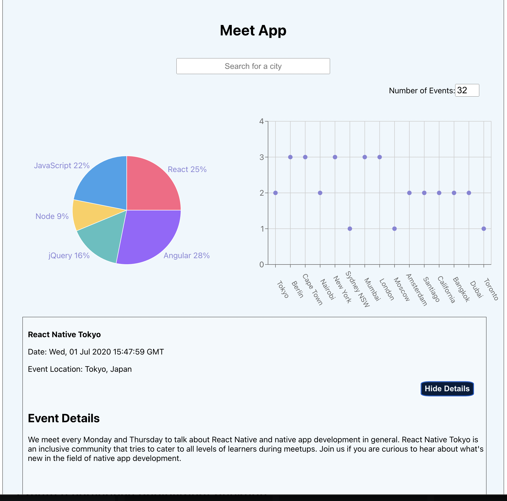

# [🔗 Meet App](https://abneralexis.github.io/meet/)

## USER STORIES
### 1. Filter Events By City

As a user, 
I should be able to filter events by city 
So that I can easily find events happening in a specific location.
 
### 2. ShowHide Event Details

As a user, 
I should be able to show/hide event details 
So that I can focus on the information that is relevant to me.

### 3. Specify Number of Events

As a user, 
I should be able to specify the number of events I want to see 
So that I can control the amount of information displayed.

### 4. Use the App When Offline

As a user, 
I should be able to use the app when offline 
So that I can access event information even when I don't have an internet connection.

### 5. Add an App Shortcut to the Home Screen

As a user, 
I should be able to add an app shortcut to the home screen 
So that I can quickly access the app without navigating through multiple menus.

### 6. Display Charts Visualizing Event Details

As a user, 
I should be able to view charts visualizing event details 
So that I can quickly grasp trends, patterns, or statistics related to event.

## SCENARIOS
### 1. Filter Events By City

<strong>Scenario:</strong> User filters events by a specific city 
  <strong>Given</strong> the user is on the events page 
  <strong>When</strong> the user selects a specific city from the filter options 
  <strong>Then</strong> the events displayed should only belong to the selected city

<strong>Scenario:</strong> User filters events by a city with no events 
  <strong>Given</strong> the user is on the events page 
  <strong>When</strong> the user selects a city with no events from the filter options 
  <strong>Then</strong> a message should be displayed indicating that there are no events in the selected city
  
  ### 2. Show/Hide Event Details

<strong>Scenario:</strong> User shows event details 
  <strong>Given</strong> the user is viewing a list of events 
  <strong>When</strong> the user clicks on an event 
  <strong>Then</strong> the details of the event should be displayed 

<strong>Scenario:</strong> User hides event details 
  <strong>Given</strong> the user is viewing the details of an event 
  <strong>When</strong> the user clicks on a hide button 
  <strong>Then</strong> the event details should be hidden from view

  ### 3. Specify Number of Events

<strong>Scenario:</strong> User specifies a smaller number of events 
  <strong>Given</strong> the user is on the events page 
  <strong>When</strong> the user specifies a smaller number of events to display 
  <strong>Then</strong> only the specified number of events should be shown

<strong>Scenario:</strong> User specifies a larger number of events 
  <strong>Given</strong> the user is on the events page 
  <strong>When</strong> the user specifies a larger number of events to display 
  <strong>Then</strong> more events than the default should be shown, up to the maximum available

  ### 4.  Use the App When Offline

<strong>Scenario:</strong> User opens the app without an internet connection 
  <strong>Given</strong> the user has previously used the app and data is cached 
  <strong>When</strong> the user opens the app without an internet connection 
  <strong>Then</strong> the app should load cached data and be fully functional

<strong>Scenario:</strong> User tries to access new data without an internet connection 
  <strong>Given</strong> the user has previously used the app and data is cached 
  <strong>When</strong> the user tries to access new data or perform actions requiring an internet connection 
  <strong>Then</strong> a message should be displayed indicating that an internet connection is required

  ### 5. Add an App Shortcut to the Home Screen

<strong>Scenario:</strong> User adds an app shortcut to the home screen 
  <strong>Given</strong> the user is on the app's homepage 
  <strong>When</strong> the user selects the option to add a shortcut to the home screen 
  <strong>Then</strong> a shortcut should be added to the home screen

  ### 6. Display Charts Visualizing Event Details

<strong>Scenario:</strong> User views a chart visualizing event details 
  <strong>Given</strong> the user is viewing event details 
  <strong>When</strong> the user selects the option to view a chart 
  <strong>Then</strong> a chart representing relevant event details should be displayed

###  🖥️ Technology Used
* React 
* TDD technique
* Serverless functions
* Google Calendar API 
* OAuth2 authentication flow 
* Github Pages